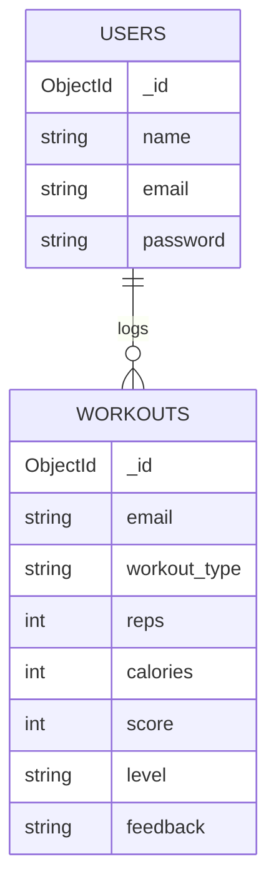

# Database Design

AI Gym Assistant uses MongoDB Atlas through the FastAPI backend. The database
name is `ai_gym_database`.

## Main Collections

## Collection Notes

### users

Stores registered user accounts created through `/signup`.

| Field | Type | Description |
| --- | --- | --- |
| `_id` | ObjectId | MongoDB document id |
| `name` | string | User display name |
| `email` | string | Unique login identifier |
| `password` | string | Hashed password |

### workouts

Stores workout history submitted through `/save-workout`.

| Field | Type | Description |
| --- | --- | --- |
| `_id` | ObjectId | MongoDB document id |
| `email` | string | User identifier used to link workouts |
| `workout_type` | string | Exercise category, such as pushup or squat |
| `reps` | integer | Repetition count |
| `calories` | integer | Estimated calories burned |
| `score` | integer | Performance score from workout analysis |
| `level` | string | Performance level returned by analysis |
| `feedback` | string | AI-generated workout feedback |

## Data Flow

1. The frontend sends user and workout data to FastAPI endpoints.
2. FastAPI validates request bodies with Pydantic models.
3. Controllers read or write MongoDB documents through `database/db.py`.
4. Dashboard, profile, history, achievements, and leaderboard pages read
   aggregated workout data from the backend.
